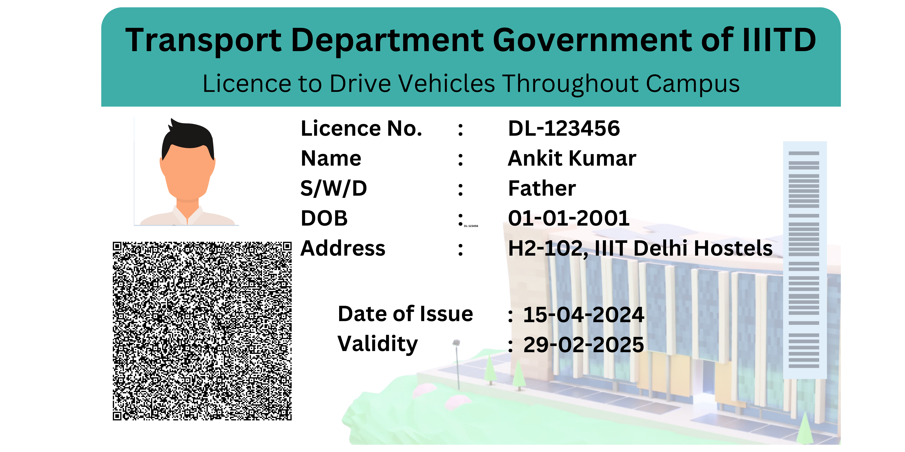
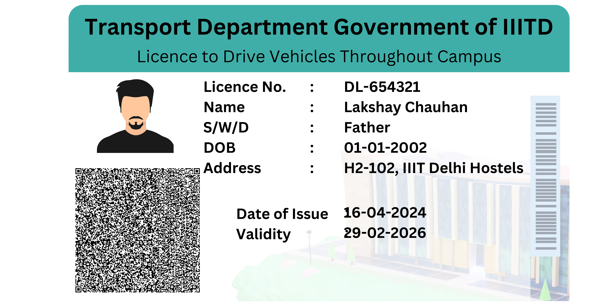

## Programming assignment no. 4
### Project 3 On-the-go verification of Driver’s License
> Ankit Kumar 20201015 & Lakshay Chauhan 2021060

The objective is to create a secure and verifiable driver's license system using cryptography. The system will be used by the traffic police to verify the authenticity of the driver's license. 

Lets take examples from the below image
- 

- 

The above image is a sample driver's license. The driver's license contains the following information:
- DL No: The driver's license number
- DOI: The date of issue of the driver's license
- Validity: The validity of the driver's license
- Name: The name of the driver
- DOB: The date of birth of the driver
- Address: The address of the driver

It also contains a QR code that encodes the additional information other than the above mentioned information. 
+ data_signature
+ categories
+ restrictions

There are two code files
- `generate_qr.py : It reads a JSON file and generates a QR code with the data in the JSON file. The QR code is saved as an image file. It also save the private and public key in new files in the same directory.
- `QR_verification.py : It reads the QR code image and verifies the data in the QR code using the public key. It also checks the integrity of the data using the digital signature.


### Data Tampering and validity failure
- If the data in the QR code is tampered with, the digital signature verification will fail, indicating that the data has been altered.
Steps to achieve the above:
- Uncomment the code in the `generate_qr.py` file that modifies the data in the JSON file before generating the QR code.
- Run the `generate_qr.py` file to generate the QR code with tampered data.
- Run the `QR_verification.py` file to verify the tampered data(name_tampered.png). The verification will fail, indicating that the data has been tampered with.


#### 1. What is the information to be supplied by the driver to the police officer? And what information is sought and obtained by the police officer from the server in the transport authority?
Information Supplied by the Driver:
The driver would show the physical driver's license to the police officer. This license could contain a QR code, which encodes the information mentioned above.

Information Obtained by the Police Officer:
- The police officer would use a device/ smartphone app to scan the QR code and send the encrypted information to the central server of the transport authority.
- Verify the digital signature against the public key stored on the server. Optionally, check the status of the license (e.g., validity, any suspensions or restrictions not listed on the card).
- Upon successful decryption and verification, the server would send back confirmation of the validity of the license, along with the driver's details for the officer to compare with the physical card.
#### 2. Would you need a central server that has the correct and complete information on all drivers and the licenses issued to them?
- Yes, a central server is essential for this system to work efficiently. 
Reasons:
- To store public keys for verifying digital signatures.
- To maintain updated records of all issued driver’s licenses, ensuring any changes or revocations of licenses are promptly reflected.
- To provide additional verification services to confirm that a license is still valid when checked against real-time data (e.g., to check if a license has been suspended since the last update).
#### 3. In what way are digital signatures relevant?
- Digital signatures are crucial as they ensure that the license has been issued by the legitimate authority and not tampered with. They provide a means of authentication and integrity.
#### 4. Does one need to ensure that information is kept confidential? Or not altered during 2-way communication?
- Information must be protected from unauthorized access (confidentiality) and must not be altered in transit (integrity). RSA encryption helps maintain confidentiality, while digital signatures and secure hash algorithms can ensure integrity.
### 5. Which of these, viz. confidentiality, authentication, integrity and non-repudiation is/are relevant?
- Confidentiality: Not much since the license details are not sensitive information and printed on the card itself. the confidentiality of the data in the QR code might not be as critical (since the QR code is openly presented), ensuring that the data is not altered during communication is paramount. Using secure communication protocols (like TLS/SSL) can protect data integrity and confidentiality during transmission between the officer’s device and the central server.
- Authentication: Verifying that the license was indeed issued by the transport authority and not forged.
- Integrity: Making sure that the license details have not been altered since issuance.
- Non-repudiation: Preventing the issuing authority from denying the issuance of the license.

### Is date and time of communication important?

#### The date and time of the verification are important for:

- Logging and auditing purposes: To maintain records of when a license was checked, which can be crucial in legal scenarios or disputes.
- Real-time validation: Ensuring that the verification checks the most current data, considering any very recent changes like suspensions.

#### Obtaining secure date and time:

To securely obtain the date and time, devices can use Network Time Protocol (NTP) secured by cryptographic measures like DTLS (Datagram Transport Layer Security), ensuring the time data hasn’t been tampered with during transit.


The following is the implementation of the above system using RSA encryption and decryption in pseudo code. We have implemented it in python and you can find it in the file `QR_verification.py`but it can be implemented in any desired language

- The input is the QR code presented on the image

```C
BEGIN

  // Function to Load Public Key from a File
Function LoadPublicKey(filePath):
    Open file specified by filePath
    Read public key data from file
    Deserialize the public key data into a public key object
    Return the public key object

// Function to Verify the Digital Signature
Function VerifySignature(publicKey, data, signature):
    Try:
        Use publicKey to verify the signature against the data
        If the verification is successful:
            Return True
        Else:
            Return False
    Catch any errors:
        Return False

// Function to Decode QR Code and Extract Data
Function DecodeQRCode(imagePath):
    Open the image file specified by imagePath
    Decode the QR code present in the image
    Extract and return the data encoded in the QR code

// Main Verification Function
Function MainVerification(imagePath, publicKeyPath):
    // Load the public key
    publicKey = LoadPublicKey(publicKeyPath)
    
    // Decode the QR code to get the JSON data with signature
    jsonData = DecodeQRCode(imagePath)
    Convert jsonData from string to a dictionary object
    
    // Extract the signature from the JSON data
    signature = jsonData['driving_license'].pop('data_signature')
    Convert signature from hex to byte array
    
    // Convert the remaining jsonData back to a sorted JSON string
    dataString = Convert jsonData to JSON string with sorted keys
    
    // Verify the digital signature
    verificationResult = VerifySignature(publicKey, dataString, signature)
    
    If verificationResult is True:
        Print "The data is intact and authentic."
    Else:
        Print "Data integrity check failed."

// Execute the main function
MainVerification('path_to_qr_code_image.png', 'path_to_public_key.pem')

END
```
